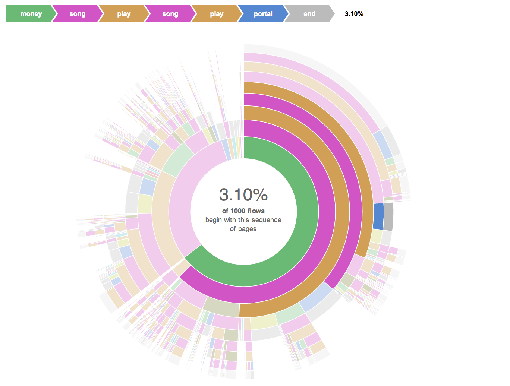

#Radial Flows
_Radial flow (sunburst) data visualization_

This visualization exposes common (and uncommon) user flows within a certain timeframe.

For example, the radial flow in the image below reveals that 3.1% of users in the last 1000 sessions interacted with a jukebox like this:

money - song - play - song - play - portal - end

##How it works

`latest_radial_sequence_data.rb` reads data from the Gen3+ 4.3 Prod project in Keen IO, sorts the data into user flows and publishes a new event collection to a project in Keen IO.

1. Open `settings.yml` and specify the project keys, name of the event collection you're saving to Keen IO, `collection_name`, and the number of events you'd like to analyze, `num_latest_events`.
2. When you're ready to create a new event collection for user flow data, run this script in **terminal** `ruby latest_radial_sequence_data.rb`.
3. Run this command in **terminal** `python -m SimpleHTTPServer 9000`, and then in a browser tab, open [http://localhost:9000/dataview/](http://localhost:9000/dataview/)
4. Type in the name of your **event collection** (e.g. the `collection_name` you specified in `settings.yml`) and hit "Go!". Your data visualization should appear momentarily.
